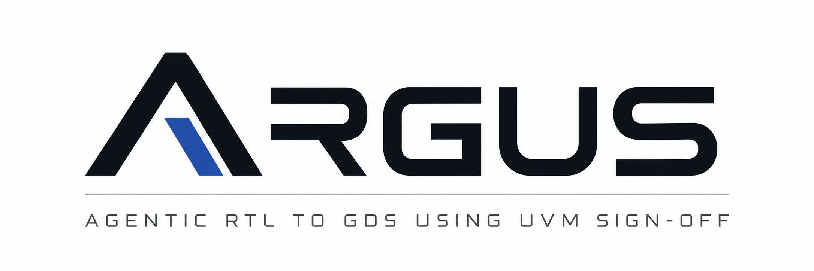

# ARGUS — Agentic RTL-to-GDS Using UVM Sign-off



Two independent LLM-driven hardware loops, plus an orchestrator that chains
them into one RTL-to-GDS run.

| Directory | What it does |
|---|---|
| `uvm_loop/` | Spec + reference model → generated Cocotb/pyUVM testbench → Verilator simulation → iterative testbench and RTL repair until the RTL is verified |
| `orfs_loop/` | LLM tunes whitelisted OpenROAD-flow-scripts knobs until timing/DRC closure, then DRC/LVS signoff |
| `rtl_to_gds/` | Runs the UVM loop, gates on its verification verdict, and feeds the accepted RTL into the ORFS loop |
| `docs/` | [Troubleshooting](docs/TROUBLESHOOTING.md) — every failure mode we hit, with signatures and fixes |

Both loops are built on the `chia` agent framework (a Ray cluster of Docker
workers; LLM access via `chia.models.opencode.OpenCodeLLM`). They share no
code — treat each subdirectory as its own project, with its own `cluster.yaml`,
and run commands from inside it.

## Setup

### Prerequisites

- **Linux** with **Docker** running, usable without `sudo` (the flows shell out
  to Verilator, Yosys, OpenROAD and KLayout inside Linux-only images).
- **Conda**, with a `chia_env` environment providing the `chia` CLI and `ray`
  (distributed separately from this repo — confirm `chia --help` and
  `ray --version` work first), plus `cocotb`, `pyuvm`, `pytest`, `pyyaml`
  and `pydantic`.
- Disk: one ORFS run can produce hundreds of MB under `orfs_runs/`.
- No GPU.

### 1. Clone and bootstrap

```bash
git clone https://github.com/UGRA-IITBHU/argus.git
cd argus
./startup.sh
```

`startup.sh` checks prerequisites, initialises the ORFS submodule and its
sky130hd LVS/CDL patch, and creates the two credential files from
`templates/` with placeholder keys. It never overwrites an existing file and
is safe to re-run.

### 2. Add LLM credentials

Both files `startup.sh` created still contain `REPLACE_WITH_...` placeholders.

- `~/.local/share/opencode/auth.json` — keys for opencode's built-in providers.
  Catalog models (`opencode/big-pickle`, `opencode/mimo-v2.5-free`, …) pick up
  their key from here automatically by provider name.
- `~/.config/opencode/opencode.jsonc` — extra providers, i.e. extra quota
  buckets. Recommended: a single free-tier key rate-limits quickly. Each custom
  provider needs its own key inlined in `options.apiKey`.

Don't hand-edit `opencode.jsonc` beyond a first test. Once the cluster is up:

```bash
uvm_loop/scripts/add_llm_provider.sh <base_url> <api_key> <model_name> [slug]
```

That registers the provider, copies the file into every running opencode
container (it is not bind-mounted, so a host-only edit never reaches a
container), smoke-tests it live, and only then adds it to the fallback list.

Each loop has a fallback list tried in order when the current model
rate-limits or errors — `uvm_loop/config/llm_models.txt` (maintained by
`add_llm_provider.sh`) and `orfs_loop/llm_fallback_models.txt` (manual).
Put your most reliable models first and comment out ones your account can't use.

### 3. Run one loop

```bash
conda activate chia_env

cd uvm_loop
docker build -t chia-rtl-worker:local -f workers/rtl/Dockerfile .
make build-sim-image
./setup.sh
python3 -m pipeline.run14 --design-config benchmarks/fifo/design.yaml
```

```bash
cd orfs_loop
docker build -f Dockerfile.orfs-run -t chia-orfs-run:local .
export CHIA_ORFS_REPO=$(pwd)
chia up cluster.yaml -y
python3 orfs_loop.py --design-name riscv32i \
  --design-config-mk /root/OpenROAD-flow-scripts/flow/designs/sky130hd/riscv32i/config.mk \
  --reports-root /root/OpenROAD-flow-scripts/flow/reports/sky130hd/riscv32i/base \
  --max-iterations 6 --objective area --model opencode/big-pickle
```

### 4. Run the combined RTL → GDS pipeline

The combined cluster is required — both loops' containers must be up at once,
and the per-loop cluster files share container names but use different mounts.

```bash
conda activate chia_env
export CHIA_PROJECT_ROOT=$PWD/uvm_loop
export CHIA_ORFS_REPO=$PWD/orfs_loop
chia up rtl_to_gds/cluster.yaml -y

python3 rtl_to_gds/rtl_to_gds.py --design-config benchmarks/fifo/design.yaml \
  --clock-period 10 \
  -- --max-iterations 3 --objective area --model opencode/big-pickle \
     --stage-timeout-seconds 7200
```

Arguments after `--` go to `orfs_loop.py`. See
[`rtl_to_gds/README.md`](rtl_to_gds/README.md) for the full flag reference —
including `--core-utilization 10` for tiny designs, `--skip-uvm` to reuse an
existing verified result, and `--prepare-only` to test the handoff with no
cluster.

### Where output lands

A combined run gathers everything into **one folder per run**, grouped by the
stage that produced it:

```text
runs/<design>/<timestamp>/
├── final.gds       # the deliverable (hardlink of orfs/final.gds)
├── uvm/            # verification state, results, checkpoints, accepted RTL
├── orfs/           # the ORFS run dir, moved in: gds/, reports/, flow_logs/,
│                   # signoff_logs/, summaries/, ledger.json, tool_trace.log
├── orfs_design/    # config.mk, constraint.sdc, src/, verified_rtl/,
│                   # rtl_handoff.json — the config it closed with
├── inputs/         # design.yaml, the RTL, spec and reference model
├── console.log     # full output of both stages
├── manifest.json   # what was collected, from where, and the final GDS path
└── rtl_to_gds.json # run record, linking the GDS to the verified RTL by md5
```

Nothing is filtered by extension — the GDS, the CDL/LEF/DEF, ORFS's rendered
webps and the per-iteration GDS all land here. Change the parent with
`--runs-dir`, or the whole folder with `--logs-dir`. Everything here is
regenerated per run and is gitignored.

The UVM design dir and the ORFS design dir are **copied**, not moved: both are
live working state (`improvement_state.json` is the UVM resume point, and ORFS
reads its config from `orfs_design/`'s original on every run). The ORFS *run*
dir **is** moved — it is staged under `orfs_loop/orfs_runs/` during the run
because the workers can only write inside the repo they mount, and moved into
`orfs/` afterwards.

## How the loops work

### RTL verification loop

Verification infrastructure is generated from the **specification and
reference model**, not from the RTL — so the environment can exist before the
final RTL does, and mismatches are attributed to the RTL rather than baked
into the testbench. Failures drive RTL repair, then re-verification.

```text
  Specification + Reference Model
              │
              ▼
         ARGUS + LLM  ──►  Cocotb + pyUVM testbench  ◄───────┐
                                    │                       │
                                    ▼                       │
                               Verify RTL                   │
                                    │                       │
                            ┌───────┴───────┐               │
                          PASS            FAIL              │
                            │               │               │
                            ▼               ▼               │
                       Verified      Analyse → Modify RTL ──┘
```

Covers reference-model scoreboarding, directed and randomised stimulus,
functional coverage, assertions, regression, failure analysis and RTL repair —
distributed over Ray.

`spec.md` must describe *intended* behaviour, not what the current RTL does;
the loop may modify RTL to match the spec.

### RTL-to-GDS optimisation loop

Runs ORFS, reads back PPA/timing/DRC, and has the LLM propose changes to a
**closed whitelist** of tunables. The driver owns execution; the LLM has no
tools and only replies with a JSON tunable diff or `CLOSURE: PASS` /
`CLOSURE: GIVE_UP`.

```text
  RTL ──► ORFS flow ──► PPA / timing / DRC
                               │
                               ▼
                          ARGUS + LLM
                               │
                               ▼
                  constrained tunable changes
                               │
                               └──► next run ──► … ──► closure / best GDS
```

Two nested levels: **iterations** (iteration 1 ends at first closure; each
later one must close *and* beat the previous `--objective` value) contain
uncapped **runs** (one flow plus one LLM turn). With `--batch-size N` each
slot gets its own `FLOW_VARIANT`, which is what keeps concurrent runs from
sharing paths.

Supports hard parameter locking (`--lock`, enforced in code, not by the
prompt), per-knob effect tracking across runs, stall diagnosis, and DRC/LVS
signoff.

## Status

The two loops are developed independently and share no code. `rtl_to_gds/`
integrates them in one direction today: verified RTL flows from `uvm_loop`
into `orfs_loop`, gated on the verification verdict. Feeding physical
implementation feedback back into verification is not implemented.

`orfs_loop/` is self-contained: the ORFS checkout it drives lives in-tree as
the `orfs-native-build` submodule (pinned, patched, with `tools/install/`
populated from the `chia-orfs-run:local` image). No checkout outside this repo
is needed to run anything here.
